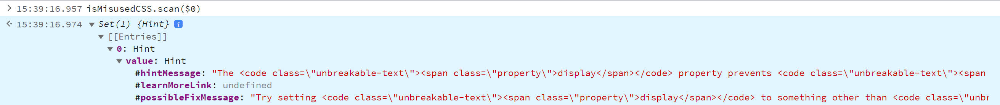

# is-misused-css
Check if CSS properties are correctly applied.

Inspired by DevTools, which offers a helpful tooltip now when CSS properties are set, but don't apply to elements. The source-code is taken from the Chromium DevTools repository, so it will show
the exactly same information, just as JavaScript API.

Please note: `font-variation-settings` is currently not checked and can currently only be checked by the DevTools.

Example:

```css
.a {
	display: block;
	align-items: center; /* <-- won't apply, because of 'display: block' => is misused */
}
```

DevTools:


`is-misused-css`:



## Usage

In the browser:

- Copy `is-misused-css.browser.js`
- Run it in a new [DevTools snippet](https://developer.chrome.com/docs/devtools/javascript/snippets/), or use a [bookmarklet](https://caiorss.github.io/bookmarklet-maker/) generator
- Run `[...document.querySelectorAll("*")].forEach(el => {const r=isMisusedCSS.scan(el);if(r.size>0)console.log(el,r)})` in your console

_(You will only see results if there is some misused CSS)_

With npm/pnpm/yarn:

`npm i is-misused-css`

```js
import { scan } from 'is-misused-css';

const hints = scan(document.querySelector('#myelement'))
console.log(hints)
```

## Further Ideas

- Minifier/Critical CSS extractors: Remove properties that do nothing
- Stylelint: Add a warning/error when there is a CSS prop that does nothing
- Eslint for JSX/TSX: Add a warning/error for CSS-in-JS
- Tailwind / Atomic CSS: Lint when classes are used that do not work together
